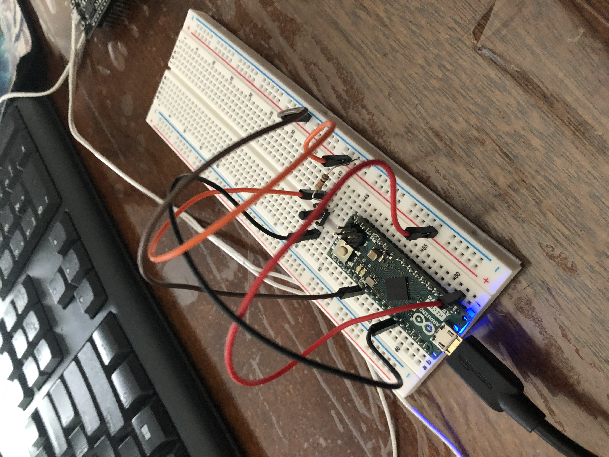

# Custom Bluetooth Controller

This project was my attempt to create a custom controller that can be connected to a computer in order to play basic computer games and potentially to offer an alternative option to a mouse and keyboard.

| **Engineer** | **School** | **Area of Interest** | **Grade** |
|:--:|:--:|:--:|:--:|
| Tanvir Islam | Brooklyn Technical High School | Electrical Engineering | Incoming Senior
  
# First Milestone

<HTML>
  

  
My first milestone was creating a circuit that uses: an Arduino Micro, pushbuttons, and resistors, in order to remotely trigger a keyboard response (the arrow keys in particular). This point marks the establishment of the basics for this project. At its core, the button press changes the state of the voltage between the sensor wire and the rest of the circuit. The value the input pin reads essentially acts as a Boolean value for an "if" statement. When the button is released, the current is no longer flowing through the sensor wire. As a result, this prompted the use of a resistor (more specifically, the pull-down resistor) whose sole purpose is to return to ground, effectively completing the circuit. The primary concept I took advantage of here is the usage of input pins and pulldown resistors.

</HTML>

My first milestone was creating a circuit that uses: an Arduino Micro, pushbuttons, and resistors, in order to remotely trigger a keyboard response (the arrow keys in particular).

# Second Milestone

# Final Milestone

**UNDER CONSTRUCTION**
