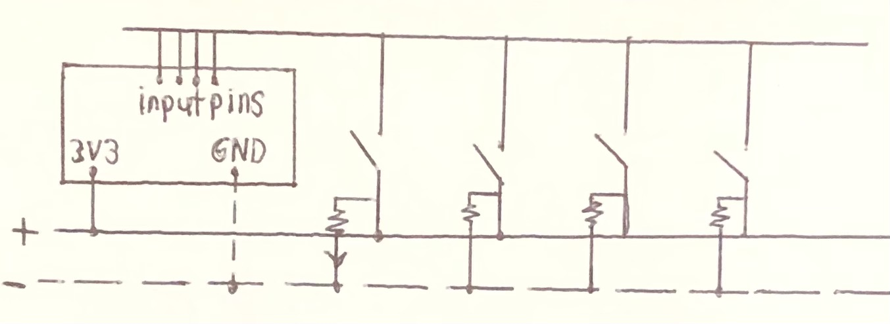

# Custom Controller 

This project was my attempt to create a custom controller that can be connected to a computer in order to play basic computer games and potentially to offer an alternative option to a mouse and keyboard.

| **Engineer** | **School** | **Area of Interest** | **Grade** |
|:--:|:--:|:--:|:--:|
| Tanvir Islam | Brooklyn Technical High School | Electrical Engineering | Incoming Senior

# Reflection

<HTML>
  
  &emsp;&ensp;I really enjoyed my time at BlueStamp. It has been a memorable experience, and I'm especially grateful for the awesome instructors that helped me get here. In regards to the project, I hope the custom controller may become a staple in the program because of the versatility and uniqueness that such a project offers. Rather than be disappointed I didn't get all the functionality I wanted, I'm excited to continue exploring for more ideas. Perhaps for now this project will just be a reminder of my first steps into the engineering world, but one day, I hope I can return to this stepping stone and turn it into something more practical.
  
</HTML>

### Demo Night

  {:target="_blank" rel="noopener"}
   
 
<HTML>
  
  
                     
  
</HTML>
  
# Fourth Milestone

<HTML>
  
  &emsp;&ensp;My final major milestone consisted of adding IR communication via a transmitter and receiver as well as an ultrasonic sensor. To complement the addition of the aforementioned sensors, I added an RGB LED that can change state when a certain IR command is received. I attempted to solder all the components together on one large perf board. Unfortunately, I was unable to complete that portion in time due to time constraints and an unexpected issue that arose.
   
  &emsp;&ensp;The IR transmitter and receiver are connected to different boards. More specifically, the receiver should be on the controller while the transmitter should be offboard completely. As their names imply, the transmitter gives off infrared signals (represented in code as a hexadecimal) which the receiver then picks up and executes the command associated with it. The ultrasonic sensor continually scans until something obstructs it, in which it internally switches the IR command transmitted.
   
  &emsp;&ensp;As for what the command change accomplishes, this disables most of the controller and allows the user to change the color of the LED. I originally planned for three separate potentiometers for the input method, but instead opted for using the WASD joystick to keep the size compact. The individual RGB values can be cycled through by clicking on the joystick's button.
   
  
</HTML>

[Controller (Arduino Micro);](code/Controller_2.ino)
[Pins and Definitions (Controller)](code/PinDefinitionsAndMore.h)
   
[External Sensors (Arduino Uno);](code/Simple_Sender__personal_.ino)
[Pins and Definitions (Sensors)](code/PinDefinitionsAndMore2.h)

  {:target="_blank" rel="noopener"}

# Third Milestone

<HTML>

  
  &emsp;&ensp;The next major step in my project was adding an accelerometer as a separate source of user input. By tilting the accelerometer in any given direction, this will carry out the same function as the joysticks. Furthermore, there is an integrated mode switch with an LED to display what mode the accelerometer is on. Of note, this is also the first time I was required to solder. Namely, the pins must be soldered to the holes on the accelerometer.
   
  &emsp;&ensp;There are four pins that must be soldered to the accelerometer board: VCC, GND, SCL (Serial Clock Line), and SDA (Serial Data Line). Assuming the board in question does not have dedicated pins for SDA and SCL, SDA must correspond to pin 2 and SCL must correspond to pin 3 in order for the accelerometer to return the proper values. When setting up the accelerometer, run a test sketch using the MPU6050 library to see what values are reflected in the serial monitor. Make sure to calibrate the code such that when the accelerometer is in a resting position, all accelerometer values return 0.
   
  &emsp;&ensp;The accelerometer returns three types of values: acceleration (m/s2), rotation (rad), and temperature (ºC) in the template I used. Given the physical scale of this project, it may be helpful to convert these values to aid in debugging. Personally, I would convert radians to degrees and Celsius to Fahrenheit. m/s2 was kept the same as the accelerometer reads the force of gravity upon its z-axis.
   
  
</HTML>

[Accelerometer](code/Gyroscope_Test.ino)
 
{:target="_blank" rel="noopener"}

# Second Milestone

<HTML>

  
  &emsp;&ensp;My second milestone includes the addition of a control stick, the usage of internal pullup resistors, and a separate button for changing the mode of the joystick from mouse control to WASD control. After understanding the basics of Arduino's functions and how to build a circuit, I focused on adding another component to increase the complexity as well as improve any pre-existing components. Some of the male-male wires were replaced with shorter variants to leave more space on the breadboard.
   
  &emsp;&ensp;The physical implementation of the control stick was relatively simple. Each pin on the control stick has a label that corresponds with a label on the Arduino Micro, all of which can be connected directly from the board to the component. More specifically, VRx and VRy connected to the analog pins as they need to detect a range of motion on a control stick, while SW is the integral button of said control stick and thus only needs a digital pin.
   
  &emsp;&ensp;Starting with the circuitry, there is a pin that connects ground on the Arduino Micro to the negative rail on the breadboard. For each button, a short wire connects the negative rail to one end of the button. On the other end, a longer wire connects each button to a pin on the Arduino. Normally, this circuit would have no potential difference throughout. However, initializing each pin as an internal pullup resistor (diagram shown) allows the circuit to not require the usage of the positive rail.
   
  &emsp;&ensp;Although not mentioned in the video, I opted for a dual analog system rather than a button-switch mechanism. This way, I can make one stick dedicated to WASD (game movement) and the other stick for the cursor.
   

  (Left) Pullup resistor diagram (note the Arduino Micro does this internally)
  
</HTML>

[Joystick and Buttons](code/Controller__1.ino)
{:target="_blank" rel="noopener"}

# First Milestone

<HTML>
  

  
  &emsp;&ensp;My first milestone was creating a circuit that uses: an Arduino Micro, pushbuttons, and resistors, in order to remotely trigger a keyboard response (the arrow keys in particular). This point marks the establishment of the basics for this project. At its core, the button press changes the state of the voltage between the sensor wire and the rest of the circuit. I initially used male-male wires to connect the breadboard, which is why it may appear very jumbled.
   
  &emsp;&ensp;To start, the power supply and ground are provided by the Arduino Micro from the 3V3 pin and the GND pin respectively. The value the input pin reads essentially acts as a Boolean value for an "if" statement. When the button is released, the current is no longer flowing through the sensor wire. As a result, this prompted the use of a resistor (more specifically, the pull-down resistor) whose sole purpose is to return to ground, effectively completing the circuit.
   
  &emsp;&ensp;It is noteworthy that I was unable to establish a Bluetooth connection with the ESP32, which would connect and disconnect from my Mac. Thankfully, the Arduino Micro was still more than sufficient for the desired outcome.
    
  
  
            
  (Left) Sketch of the first version of the circuit. Note that the bottom bars are meant to be the positive and negative column on a breadboard.
    
  (Right) Screenshot of a BlueTooth issue that prevented the connection of the ESP32.
   
  
</HTML>

[Pushbuttons](code/Pushbutton_D-Pad.ino)
 
{:target="_blank" rel="noopener"}
