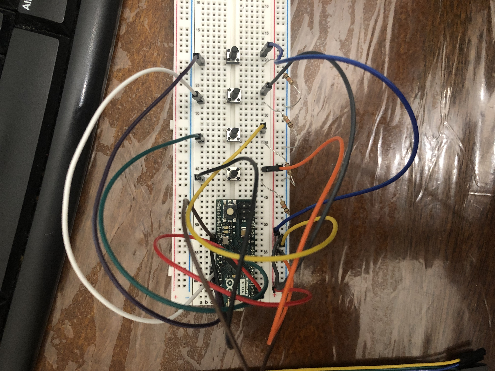

# Custom Bluetooth Controller

This project was my attempt to create a custom controller that can be connected to a computer in order to play basic computer games and potentially to offer an alternative option to a mouse and keyboard.

| **Engineer** | **School** | **Area of Interest** | **Grade** |
|:--:|:--:|:--:|:--:|
| Tanvir Islam | Brooklyn Technical High School | Electrical Engineering | Incoming Senior
  
# First Milestone

<HTML>
  

 My first milestone was creating a circuit that uses: an Arduino Micro, pushbuttons, and resistors, in order to remotely trigger a keyboard response (the arrow keys in particular). This is one angle of the final product. 
  
</HTML>

My first milestone was creating a circuit that uses: an Arduino Micro, pushbuttons, and resistors, in order to remotely trigger a keyboard response (the arrow keys in particular).

# Second Milestone
My final milestone is the increased reliability and accuracy of my robot. I ameliorated the sagging and fixed the reliability of the finger. As discussed in my second milestone, the arm sags because of weight. I put in a block of wood at the base to hold up the upper arm; this has reverberating positive effects throughout the arm. I also realized that the forearm was getting disconnected from the elbow servo’s horn because of the weight stress on the joint. Now, I make sure to constantly tighten the screws at that joint.

# Final Milestone

**UNDER CONSTRUCTION**
